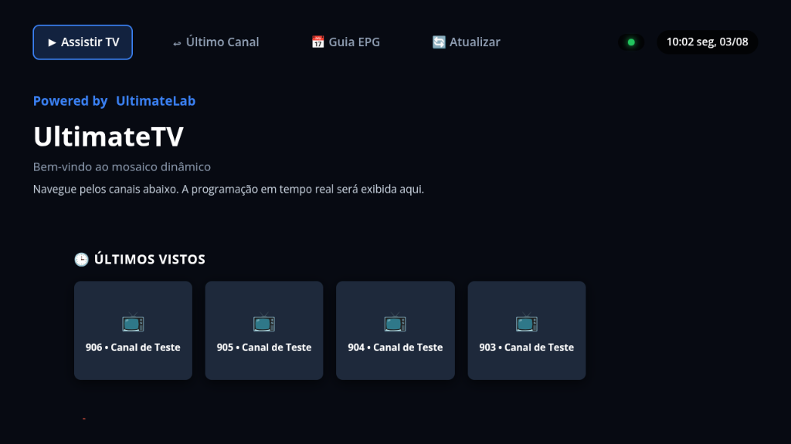
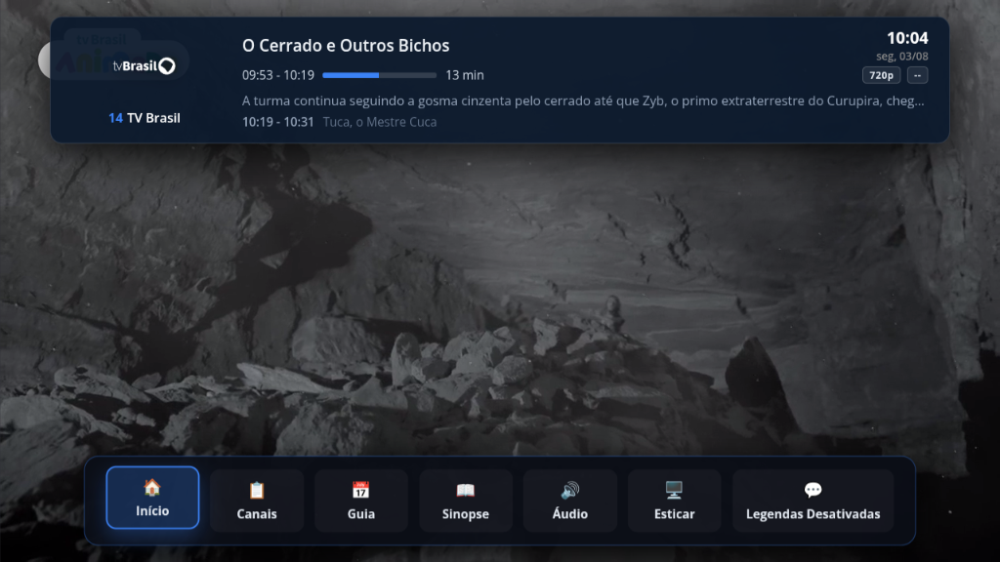
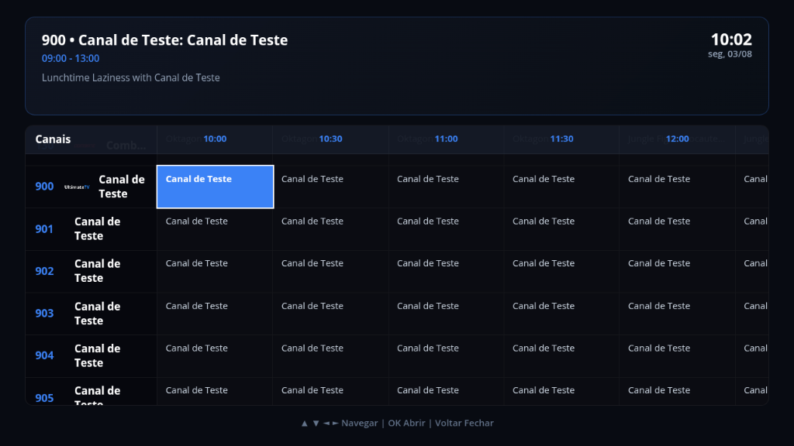

# UltimateTV

UltimateTV is an HTML5 and JavaScript IPTV player built as a dedicated web client/frontend for Dispatcharr, designed specifically for local network execution.

---

## Application Screenshots

---

## Purpose and Platforms

The project aims to deliver a user experience similar to cable TV OEM set-top boxes and mainstream streaming applications, ensuring high fluidity even on constrained hardware. The application was designed and optimized from the ground up to run efficiently on Android TV-based devices.

- **Android TV Projectors, Smart TVs, Sticks, and Set-Top Boxes:** End-to-end support, operating smoothly even on entry-level devices with 1GB of RAM.
- **Modern Web Browsers (Web/PWA):** Accessible via modern browsers for desktop viewing.

## Performance Optimizations

Designing a premium-grade UI for low-end processors required aggressive RAM and GPU optimization strategies:

- **Zero-Opacity Architecture:** Eliminated CSS opacity transitions, blurs, and complex drop shadows from the rendering pipeline. On-Screen Display (OSD), Channel Lists, and EPG menus slide using vector mathematics (	ransform: translate) paired with will-change: transform, preventing frame drops and stutters during initial animation frames.
- **Lazy Loading & DOM Caching:** The Home screen employs loading="lazy" strategies on channel logos within carousel layouts. During channel zapping, the application preserves the UI in memory rather than destroying and rebuilding the entire DOM tree, eliminating load times.
- **Strict Buffer Limits (HLS.js):** To prevent Out-of-Memory (OOM) crashes on low-spec hardware, the native HLS.js instance caps buffer retention time to short blocks with a strict RAM ceiling, discarding video resolutions higher than the display container dimensions via capLevelToPlayerSize.

## Dynamic Design

Inspired by standard TV platform interfaces, the UX architecture is split into:

1. **Flat Top Menu:** A minimal top navigation bar (Watch TV, Last Channel, EPG Guide) maximizing horizontal screen real estate.
2. **Dynamic Hero Banner:** A static yet reactive showcase panel. Navigating through the carousel updates the active program title, time slot, metadata, and synopsis in real time without interrupting the background stream.
3. **Real-time OSD & EPG:** An overlay bar displaying real-time stream resolution (1080p, 720p), metadata, and progress bars synchronized between local system time and the server backend.

## Security and Access Control (NGINX)

The web application can be hosted via web servers such as NGINX, enabling IP-based Access Control via 
ginx.conf. This enforces an invisible security layer, ensuring only authorized local devices or VPN endpoints can access the interface and media streams.

## Android Wrapper App

The generated Android application acts as a lightweight native wrapper pointing to the server hosting the web repository. Any codebase update reflects instantly across network devices upon application restart, eliminating the need to recompile APKs for UI changes.

## Final Notes

- The project does not maintain a standalone database. It relies on real-time metadata parsing provided directly by Dispatcharr (XMLTV/M3U).
- Developed without heavy Node/NPM dependencies (e.g., Webpack, React), utilizing vanilla web standards (HTML, JavaScript, CSS).

## License

Distributed under the MIT License.
